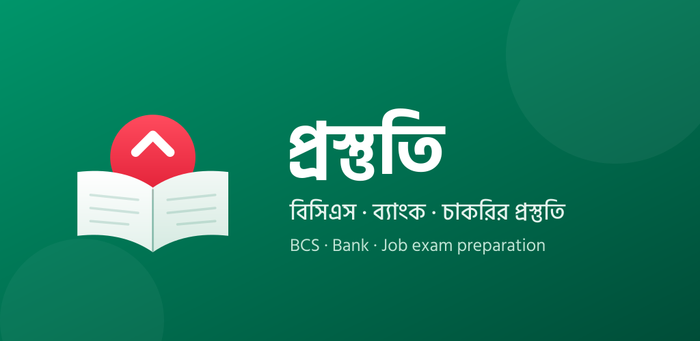
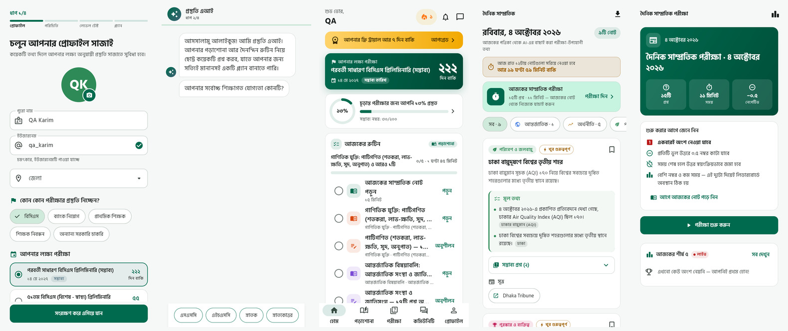
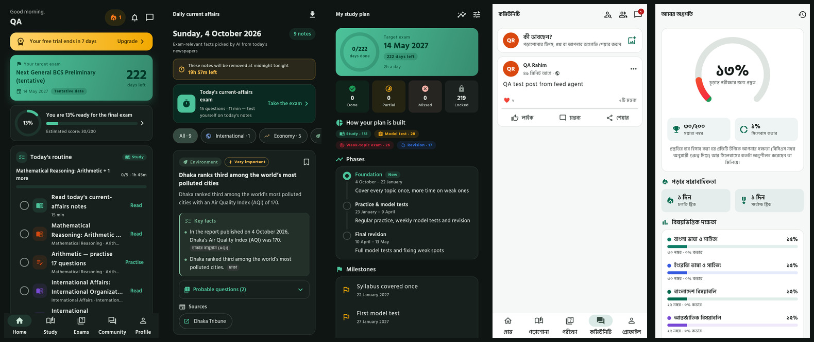

<div align="center">


# প্রস্তুতি · Prostuti

**Your companion for BCS, bank and government job exam preparation in Bangladesh.**

AI-curated daily current affairs · sourced question bank · BCS-pattern model tests ·
a personal AI study plan · community and chat · works offline · বাংলা / English

[](https://github.com/samim-reza/prostuti/actions/workflows/ci.yml)
[](https://github.com/samim-reza/prostuti/actions/workflows/android-release.yml)
[](https://github.com/samim-reza/prostuti/actions/workflows/supabase-deploy.yml)

**[⬇️ Download the latest test APK](https://github.com/samim-reza/prostuti/releases)**



</div>

---

## 📱 Screenshots

<p align="center"><b>বাংলা · Light</b></p>


<p align="center"><b>English · Dark</b></p>


---

## ✨ Features

### Study & exams
- **Question bank with sources.** 545 curated MCQs across all 10 BCS preliminary
  subjects and 88 syllabus topics. The bank grows every day with AI-generated
  current-affairs questions. Every question shows **where it came from**.
- **Model tests** (25/50/100/200 marks) in the BCS pattern, with **−0.5 negative
  marking**, a timer, a question navigator, auto-submit, per-subject results and
  answer review.
- **Practice mode** with instant feedback, **AI explanations** (bilingual,
  semantic-cached), a **wrong-answer notebook** (ভুলের খাতা) and bookmarks.
- **Offline practice packs:** download a subject, practice with no internet, and sync later.

### Current affairs (সাম্প্রতিক), every morning
- An AI pipeline reads **14 Bangladeshi and international outlets** (প্রথম আলো,
  ইত্তেফাক, Dhaka Tribune, BBC, Al Jazeera, UN News …). It picks exam-relevant
  facts and writes **daily notes** in Bangla **and** English, each linked to its
  sources.
- Notes are **available for the day only**. They leave the UI at midnight
  (Bangladesh time) and stay in the database. **Watch a rewarded ad to download
  them as a PDF** (rendered with full Bangla shaping).
- A **daily exam** is built from the day's facts, with a **live leaderboard**.
- Facts that change over time (new office holders, records) **supersede** old
  ones, and outdated questions are archived automatically.

### AI study plan
- An **AI interview** (education, background, goals) is followed by a
  **40-question level test** (Bangla, English, Math, GK).
- A personal plan runs until the next BCS (approximate date, admin-editable,
  with automatic **re-planning** when the date changes). It is shown
  **partially**: only today and the next two days.
- A **morning routine** notification (~06:30), **free days for weak-topic
  exams**, spaced repetition and a **readiness score** (প্রস্তুতির অগ্রগতি).

### Community
- **Newsfeed** with text, images (compressed), 6 reactions and threaded comments.
- **Friends:** requests, suggestions by mutual friends, district and exam, plus search.
- **Chat:** realtime 1:1 and group messaging, images, read receipts, typing
  indicators, and offline send queue.

### Platform
- **Add-ons:** every premium feature is a purchasable add-on, configured in the
  database. There is a 7-day free Prostuti Pro trial and promo codes, and the
  payment gateway is ready to plug in.
- **Bilingual:** switch বাংলা / English in Settings; the whole app follows.
- **Offline-first:** cached reads and a persistent outbox replay your actions when you're back online.
- **Screenshots and screen recording are blocked** (Android `FLAG_SECURE`, iOS secure layer and capture shield).
- Reminders at your chosen time, notification center, dark mode, admin panel
  (question review, reports, exam schedules, pipeline controls).

---

## 🏗️ Tech stack

| Layer | Technology |
|-------|-----------|
| App | **Flutter 3.47** (Android; iOS planned), Riverpod 3, go_router, Hive CE, Material 3, Hind Siliguri |
| Backend | **Supabase**: Postgres 17 + RLS, Auth, Storage, Realtime, Edge Functions (Deno), pg_cron, pg_net, Vault |
| AI | OpenAI (`gpt-5.4-mini`, `text-embedding-3-small`), pgvector HNSW semantic cache |
| CI/CD | GitHub Actions: tests, signed APK release, Supabase deploy |

### Performance & reliability toolkit
Keyset pagination everywhere · trigger-maintained counters · two-level cache
(LRU + Hive) with stale-while-revalidate · single-flight request coalescing ·
**negative caching** · **Bloom filters** (RSS de-dup and client streams) ·
**semantic cache** for LLM calls · **rate limiting** (Postgres, HTTP 429) +
client throttling · max-heap study scheduler with spaced repetition ·
isolate JSON decoding · WebP uploads · decode-size image caching.
Details in [`docs/CACHING.md`](docs/CACHING.md).

---

## 📁 Repository layout

```
prostuti/
├── app/                    Flutter app
│   ├── lib/core/           theme, router, l10n, cache, offline, pagination, services, widgets
│   ├── lib/features/       auth · onboarding · home · feed · friends · chat · notifications ·
│   │                       daily_notes · daily_exam · exam · question_bank · study · study_plan ·
│   │                       addons · profile · settings · bookmarks · admin
│   └── test/               unit + widget tests
├── supabase/
│   ├── migrations/         schema, RLS, RPCs, cron, reference data (15 ordered files)
│   ├── functions/          8 Edge Functions + shared modules (Deno, tested)
│   └── seed/questions/     question bank (JSON, with sources)
├── tools/                  db.sh, question importer, RLS smoke test, brand asset generator
├── branding/               logo sources (SVG) and rendered assets
├── docs/                   architecture & operations docs
└── .github/workflows/      CI / release / deploy
```

Each feature follows the same pattern: `data/` → `application/` → `presentation/` → `l10n/`.
Start with [`docs/ARCHITECTURE.md`](docs/ARCHITECTURE.md) and [`CONTRIBUTING.md`](CONTRIBUTING.md).

---

## 🚀 Getting started

```bash
cd app
flutter pub get
dart run tool/l10n_merge.dart && flutter gen-l10n
flutter run --dart-define=SUPABASE_ANON_KEY=<anon key>
```

Backend setup (new Supabase project), secrets, push notifications and releases:
see [`docs/RELEASE.md`](docs/RELEASE.md). Database operations:
[`docs/DATABASE.md`](docs/DATABASE.md). AI pipeline:
[`docs/AI_PIPELINE.md`](docs/AI_PIPELINE.md).

### Quality gates

| Check | Status |
|-------|--------|
| `flutter analyze` (very_good_analysis) | no issues |
| `flutter test` | 439 tests |
| Edge Functions: `deno lint` / `deno check` / `deno test` | clean / clean / 11 tests |
| RLS security regression (`tools/rls_smoke_test.sql`) | all checks pass |

```bash
cd app && flutter analyze && flutter test
cd supabase/functions && deno lint && deno check */index.ts && deno test _shared generate-study-plan
tools/db.sh file tools/rls_smoke_test.sql     # security regression test
```

---

## 📚 Documentation

| Doc | What's inside |
|-----|---------------|
| [ARCHITECTURE](docs/ARCHITECTURE.md) | layers, feature anatomy, state management, security model |
| [DATABASE](docs/DATABASE.md) | migrations, conventions, admin tasks |
| [AI_PIPELINE](docs/AI_PIPELINE.md) | news to facts to notes to exam, semantic cache, study planner |
| [CACHING](docs/CACHING.md) | caching, offline-first, rate limiting, performance |
| [ADDONS](docs/ADDONS.md) | features, add-ons, trials, promo codes, adding payments |
| [DATA_SOURCES](docs/DATA_SOURCES.md) | provenance of questions, syllabus and news |
| [RELEASE](docs/RELEASE.md) | builds, signing, CI secrets, Supabase setup, push |

---

<div align="center">
Made with ❤️ for every job seeker in Bangladesh · প্রস্তুতি হোক সবার
</div>
